# **WeBOT2.0 (12/23)**

# \[1\] WeBOT2.0  소개

* [메뉴얼](https://drive.google.com/file/d/189CQUHWR8lhY1BnAIXiBIcZ06cnUrPd4/view?usp=sharing) 

# \[2\] 원격 접속

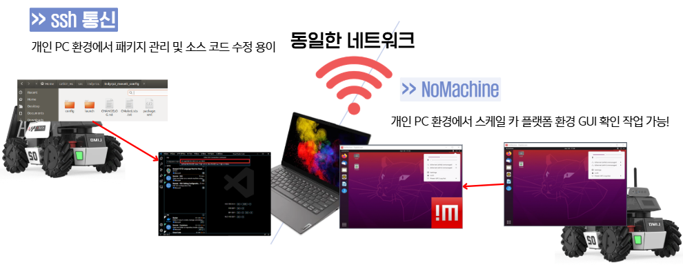

## 2.1. ssh 통신 \- vscode 기준

1. Remote Development 설치

    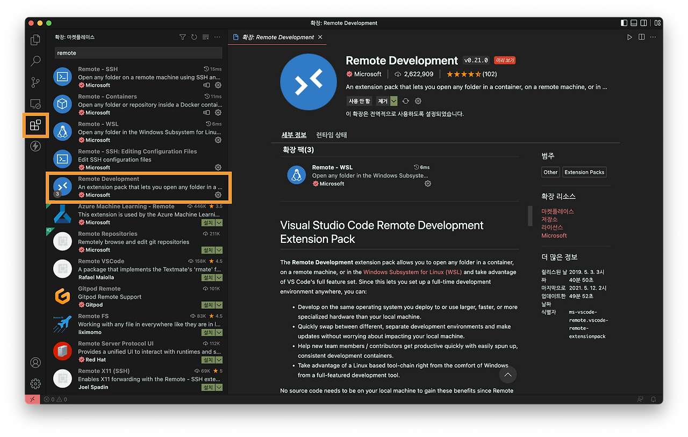

2. 원격 탐색기 \- ssh 대상 \- 추가(+) → ssh 접속 명령어 입력 → 패스워드 입력  

    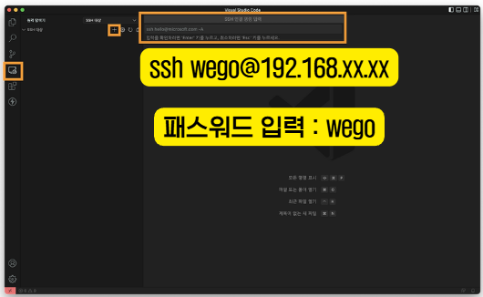

3. 탐색기 \- 폴더 열기

   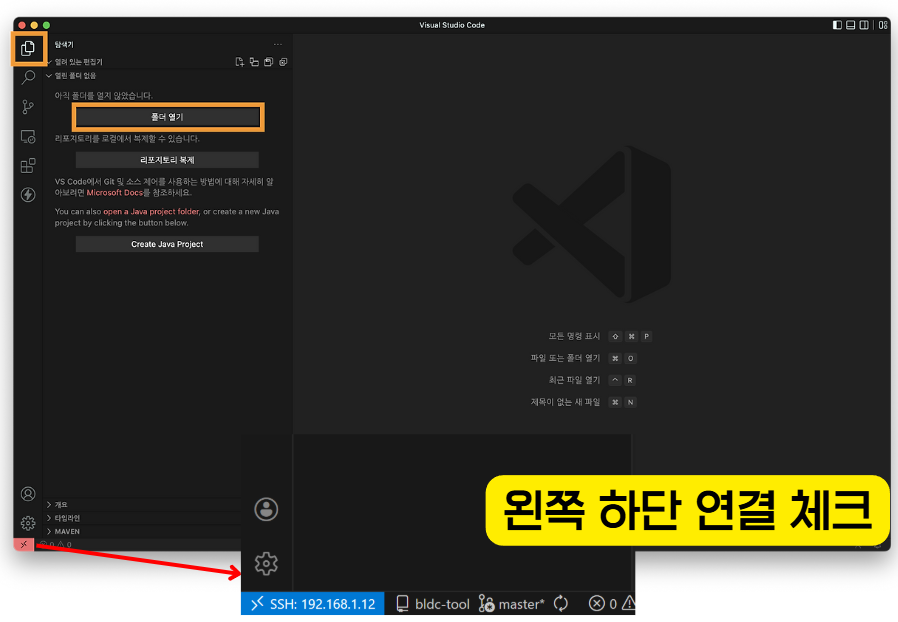  
4. 패키지 작업 진행(코드 작성 / 터미널 실행)  
   
    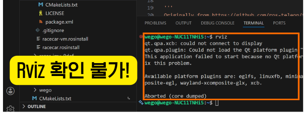
## 2.2. NoMachine

1. NoMachine 설치  
2. 자동 검색으로 나오면 바로 접속  
3. 안 나오는 경우 Add 클릭 \- Add Connection  

   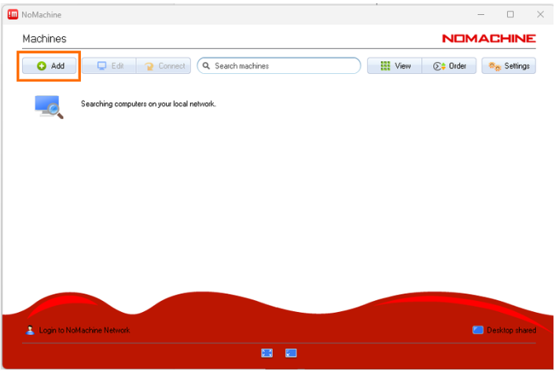

4. Name(아무거나), Host(IP 주소) 작성  

   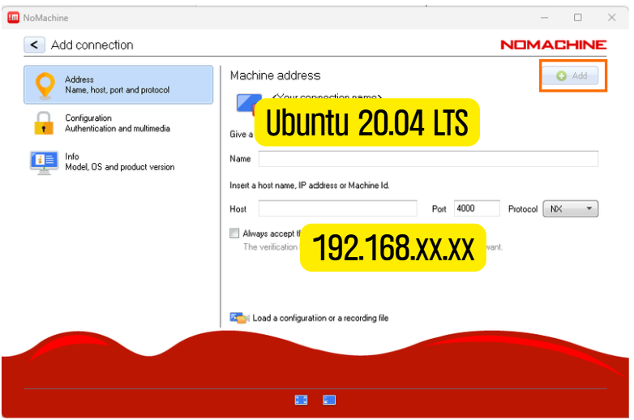

5. 접속(Verify host identification 뜰 시 OK 클릭)  

   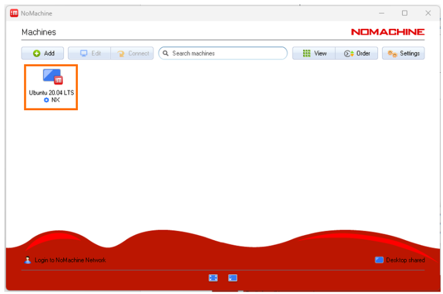

6. ubuntu 아이디 및 패스워드 입력 후 접속  

   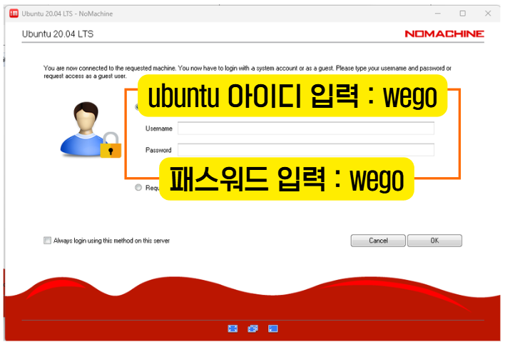  
 


   

# \[3\] WeBOT2.0 Description

## 3.1 Package

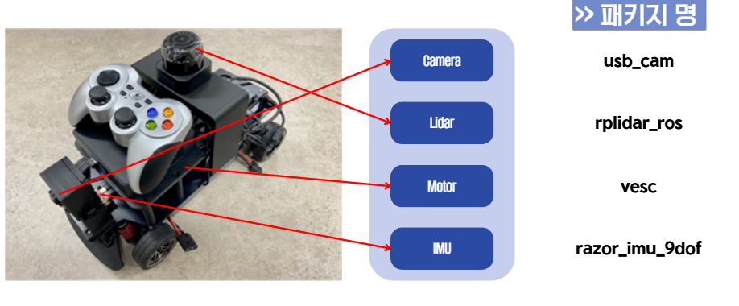

## 3.2 센서 Topic

| 센서 / 모터 | 토픽 | 용도 |
| :---- | :---- | :---- |
| USB 카메라 | `/usb_cam/image_raw/compressed` | 차선/신호등 인식 |
| RPLiDAR S1 | `/scan` | 장애물 감지 |
| Razor IMU | `/imu` | 회전 각도 측정 |
| VESC | `/ackermann_cmd_mux/input/navigation` | 모터 제어 |

## 3.3 Bringup

* Lidar 구동

```shell
roslaunch rplidar_ros rplidar_s1.launch
```

* Camera 구동

```shell
roslaunch usb_cam usb_cam-test.launch
```

* IMU 구동

```shell
roslaunch razor_imu_9dof razor_pub.launch
```

* Motor 구동

```shell
roslaunch vesc_driver vesc_driver_node.launch
```


* 전체 구동(Lidar, Camera, Motor 구동) \- joystick 조작 가능 / IMU 추가 필요

```shell
roslaunch racecar teleop.launch
```

# \[4\] Packge 구성과 launch 파일 생성

## 4.1 Package 구조화

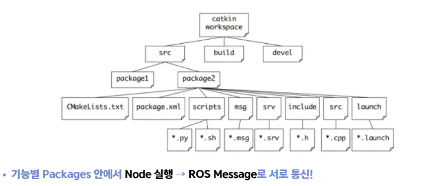

* 스스로 구분하기 쉽게 package를 구성

EX) 각 종 센서 패키지 구동을 한번에 실행하기 \= racecar 패키지 **teleop.launch**  


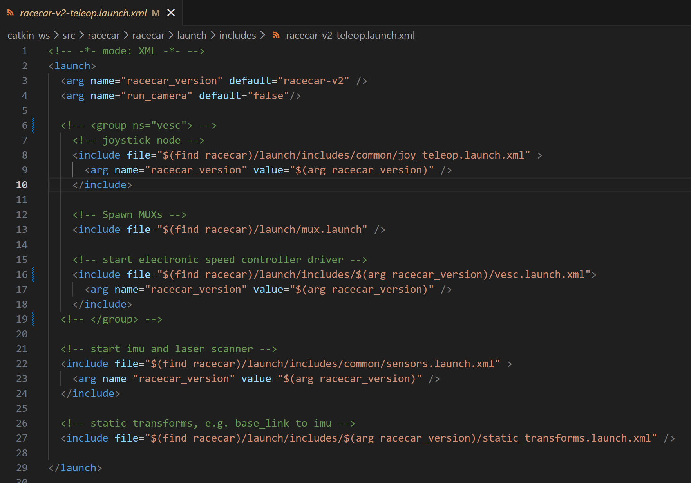

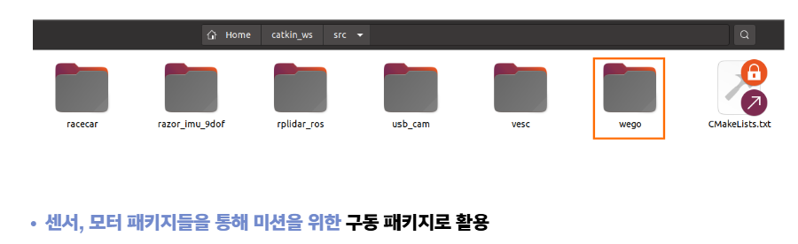

* cfg, include, launch, params, scripts 등등

## 4.2 Launch 파일

* Launch \= 여러 개의 Node와 설정을 한 번에 켜고 관리하는 파일

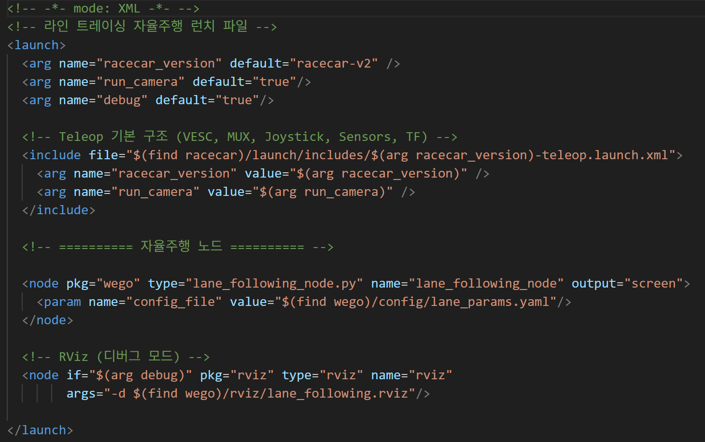  

**위 파일은 racecar teleop.launch \+ 자체 제작한 node 를 같이 실행해주는 launch 파일**

* 간단하게 표현하자면 rosrun을 한꺼번에 해줄 수 있다.  

  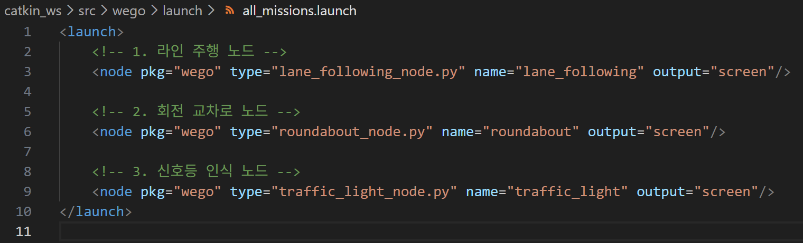  
    
    * pkg : 패키지 이름  
    * type : 실행 파일 이름  
    * name : 이 노드의 이름  
    * output=”screen” : 터미널에 로그 출력


  

**\! 실제 launch 파일 구성 시 파라미터 설정, rviz 등을 추가한다면 약간 달라짐 \!**

# \[5\] 미션 관련 실습

## 5.1 Camera

### 5.1.1 OpenCV를 활용하여 색깔 구별

```py
#!/usr/bin/env python3
# -*- coding: utf-8 -*-

import rospy
import cv2
import numpy as np
from sensor_msgs.msg import CompressedImage

# ========================================
# HSV 임계값 설정
# ========================================
B_LOW = (100, 100, 100)
B_HIGH = (150, 255, 255)
G_LOW = (30, 80, 80)
G_HIGH = (90, 255, 255)
R_LOW = (0, 100, 100)
R_HIGH = (30, 255, 255)
R2_LOW = (150, 100, 100)
R2_HIGH = (180, 255, 255)


# Publisher (전역)
pub_original = None
pub_blue = None
pub_green = None
pub_red = None


def publish_image(publisher, img):
    """이미지를 CompressedImage로 발행"""
    msg = CompressedImage()
    msg.header.stamp = rospy.Time.now()
    msg.format = "jpeg"
    msg.data = np.array(cv2.imencode('.jpg', img)[1]).tobytes()
    publisher.publish(msg)


def image_callback(msg):
    """이미지 콜백"""
    np_arr = np.frombuffer(msg.data, np.uint8)
    img = cv2.imdecode(np_arr, cv2.IMREAD_COLOR)
   
    if img is None:
        return
   
    # BGR → HSV 변환
    hsv = cv2.cvtColor(img, cv2.COLOR_BGR2HSV)
   
    # 각 색상 마스크 생성
    b_mask = cv2.inRange(hsv, B_LOW, B_HIGH)
    g_mask = cv2.inRange(hsv, G_LOW, G_HIGH)
    r_mask1 = cv2.inRange(hsv, R_LOW, R_HIGH)
    r_mask2 = cv2.inRange(hsv, R2_LOW, R2_HIGH)
    r_mask = cv2.bitwise_or(r_mask1, r_mask2)
   
    # 마스크 적용
    blue_img = cv2.bitwise_and(img, img, mask=b_mask)
    green_img = cv2.bitwise_and(img, img, mask=g_mask)
    red_img = cv2.bitwise_and(img, img, mask=r_mask)
   
    # 발행
    publish_image(pub_original, img)
    publish_image(pub_blue, blue_img)
    publish_image(pub_green, green_img)
    publish_image(pub_red, red_img)


def main():
    global pub_original, pub_blue, pub_green, pub_red
   
    rospy.init_node('color_filter')
   
    # Publisher 설정
    pub_original = rospy.Publisher('/practice/original/compressed', CompressedImage, queue_size=1)
    pub_blue = rospy.Publisher('/practice/blue/compressed', CompressedImage, queue_size=1)
    pub_green = rospy.Publisher('/practice/green/compressed', CompressedImage, queue_size=1)
    pub_red = rospy.Publisher('/practice/red/compressed', CompressedImage, queue_size=1)
   
    # Subscriber 설정
    rospy.Subscriber('/usb_cam/image_raw/compressed', CompressedImage, image_callback, queue_size=1)
   
    rospy.loginfo("=" * 50)
    rospy.loginfo("HSV 색상 분리 시작!")
    rospy.loginfo("rqt_image_view에서 /practice/xxx/compressed 확인")
    rospy.loginfo("=" * 50)
   
    rospy.spin()

if __name__ == '__main__':
    main()
```

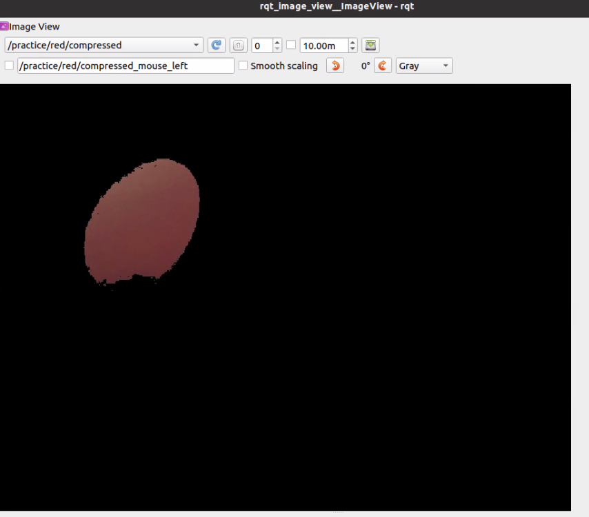

* /practice/red/compressed를 따로 publish하여 확인

```shell
roslaunch usb_cam usb_cam-test.launch
rosrun <your_package_name> <your_code_name>.py
rqt_image_view #rviz에서 Add로 확인 가능  
```

### 5.1.2 Camera 인식 범위 설정(ROI)

```py
#!/usr/bin/env python3
# -*- coding: utf-8 -*-

import rospy
import cv2
import numpy as np
from sensor_msgs.msg import CompressedImage

ROI_X = 320
ROI_Y = 150
ROI_W = 50
ROI_H = 50

# Publisher (전역)
pub_roi = None


def publish_image(publisher, img):
    """이미지를 CompressedImage로 발행"""
    msg = CompressedImage()
    msg.header.stamp = rospy.Time.now()
    msg.format = "jpeg"
    msg.data = np.array(cv2.imencode('.jpg', img)[1]).tobytes()
    publisher.publish(msg)


def image_callback(msg):
    """이미지 콜백"""
    np_arr = np.frombuffer(msg.data, np.uint8)
    img = cv2.imdecode(np_arr, cv2.IMREAD_COLOR)
   
    if img is None:
        return
   
    # ROI 지정
    roi = img[ROI_Y:ROI_Y+ROI_H, ROI_X:ROI_X+ROI_W]
   
    # ROI 영역에 사각형 그리기
    cv2.rectangle(roi, (0, 0), (ROI_W-1, ROI_H-1), (0, 255, 0), 2)
   
    # 원본 이미지에도 ROI 위치 표시
    cv2.rectangle(img, (ROI_X, ROI_Y), (ROI_X+ROI_W, ROI_Y+ROI_H), (0, 255, 0), 2)
    cv2.putText(img, "ROI", (ROI_X, ROI_Y-10), cv2.FONT_HERSHEY_SIMPLEX, 0.5, (0, 255, 0), 2)
   
    # 발행
    publish_image(pub_roi, img)


def main():
    global pub_roi
   
    rospy.init_node('roi_example')
   
    # Publisher 설정
    pub_roi = rospy.Publisher('/practice/roi/compressed', CompressedImage, queue_size=1)
   
    # Subscriber 설정
    rospy.Subscriber('/usb_cam/image_raw/compressed', CompressedImage, image_callback, queue_size=1)
   
    rospy.loginfo("=" * 50)
    rospy.loginfo("ROI 설정 예제")
    rospy.loginfo(f"ROI: x={ROI_X}, y={ROI_Y}, w={ROI_W}, h={ROI_H}")
    rospy.loginfo("rqt_image_view에서 /practice/roi/compressed 확인")
    rospy.loginfo("=" * 50)
   
    rospy.spin()


if __name__ == '__main__':
    main()
```

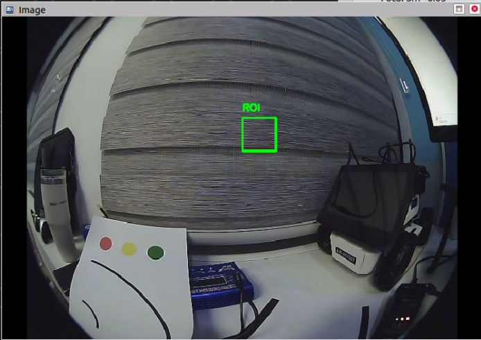

* /pratice/roi/compressed를 따로 publish하여 확인

## 5.2 Lidar

### 5.2.1 Lidar 거리 인식 별 모터 속도 조절

```py
#!/usr/bin/env python3
# -*- coding: utf-8 -*-

import rospy
import numpy as np
from sensor_msgs.msg import LaserScan
from ackermann_msgs.msg import AckermannDriveStamped


TARGET_DISTANCE = 0.3   # 목표 거리 (m)
STOP_DISTANCE = 0.15    # 정지 거리 (m)
NORMAL_SPEED = 0.5      # 정상 속도 (m/s)
SLOW_SPEED = 0.2        # 감속 속도 (m/s)
FRONT_WINDOW = 50       # 전방 감지 범위 (포인트 수)


# Publisher (전역)
drive_pub = None


def scan_callback(msg):
    """LiDAR 콜백"""
    ranges = np.array(msg.ranges)
    total = len(ranges)
   
    # 전방 범위 추출 (인덱스 0 근처가 전방)
    front_left = ranges[:FRONT_WINDOW]
    front_right = ranges[total-FRONT_WINDOW:]
    front_ranges = np.concatenate([front_left, front_right])
   
    # 최소 거리 계산 (0이나 무한대 제외)
    valid = front_ranges[(front_ranges > 0.01) & (front_ranges < 10.0)]
   
    if len(valid) == 0:
        min_dist = 10.0
    else:
        min_dist = np.min(valid)
   
    # 속도 결정
    if min_dist < STOP_DISTANCE:
        speed = 0.0
        status = "STOP"
    elif min_dist < TARGET_DISTANCE:
        speed = SLOW_SPEED
        status = "SLOW"
    else:
        speed = NORMAL_SPEED
        status = "GO"
   
    # 명령 발행
    drive_msg = AckermannDriveStamped()
    drive_msg.header.stamp = rospy.Time.now()
    drive_msg.drive.speed = speed
    drive_msg.drive.steering_angle = 0.0
    drive_pub.publish(drive_msg)
   
    # 터미널 출력
    rospy.loginfo_throttle(0.3, f"전방: {min_dist:.2f}m | {status} | {speed:.1f}m/s")


def main():
    global drive_pub
   
    rospy.init_node('lidar_follow')
   
    # Publisher 설정
    drive_pub = rospy.Publisher('/ackermann_cmd_mux/input/navigation', AckermannDriveStamped, queue_size=1)
   
    # Subscriber 설정
    rospy.Subscriber('/scan', LaserScan, scan_callback, queue_size=1)
   
    rospy.loginfo("=" * 50)
    rospy.loginfo("LiDAR 거리 유지 시작!")
    rospy.loginfo(f"목표 거리: {TARGET_DISTANCE}m, 정지 거리: {STOP_DISTANCE}m")
    rospy.loginfo("=" * 50)
   
    rospy.spin()


if __name__ == '__main__':
    main()
```